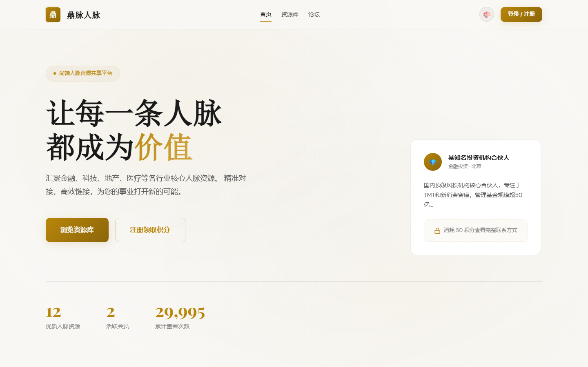
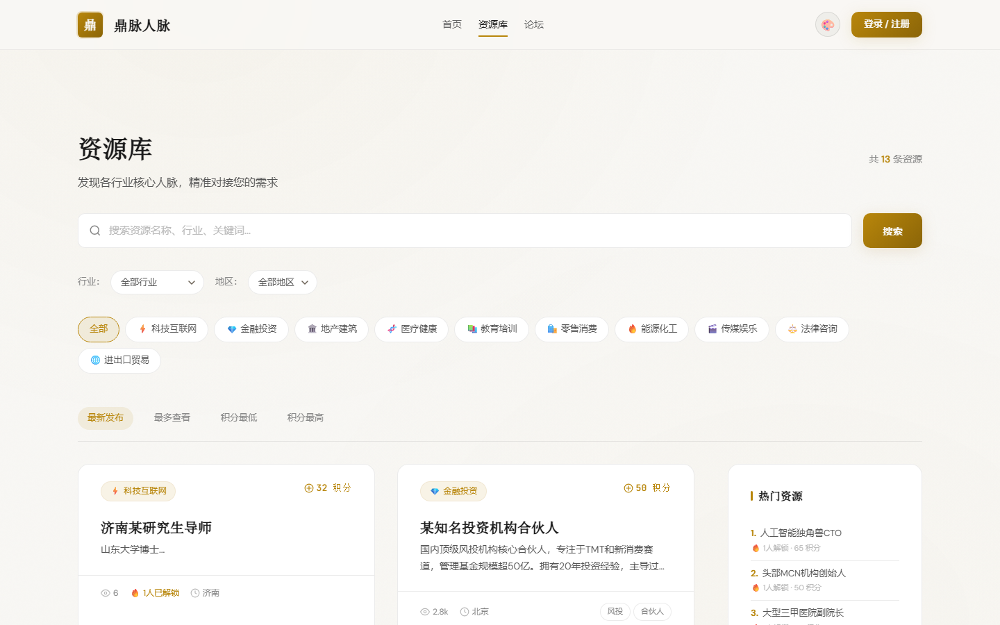
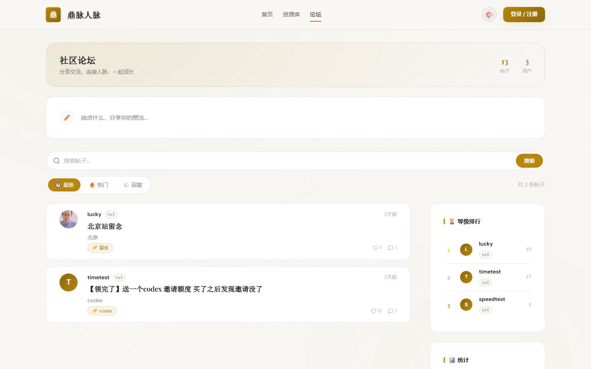
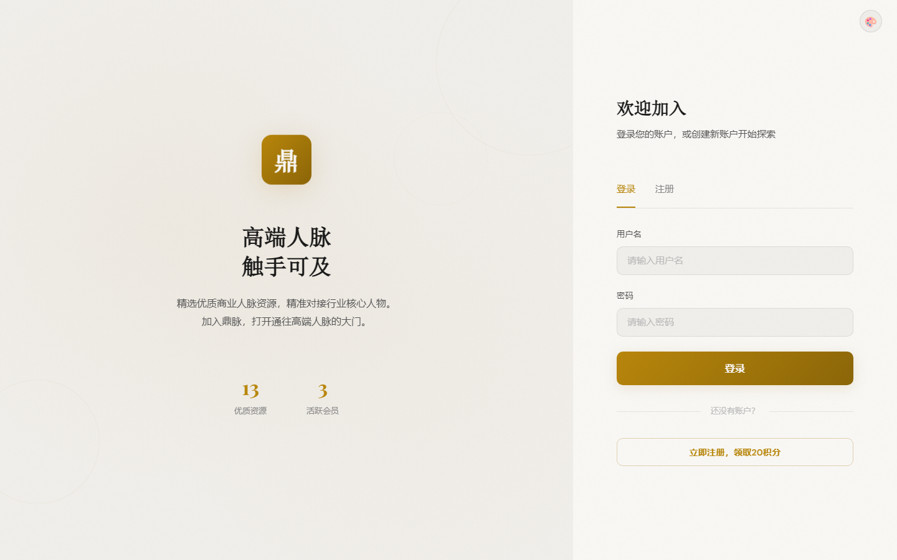
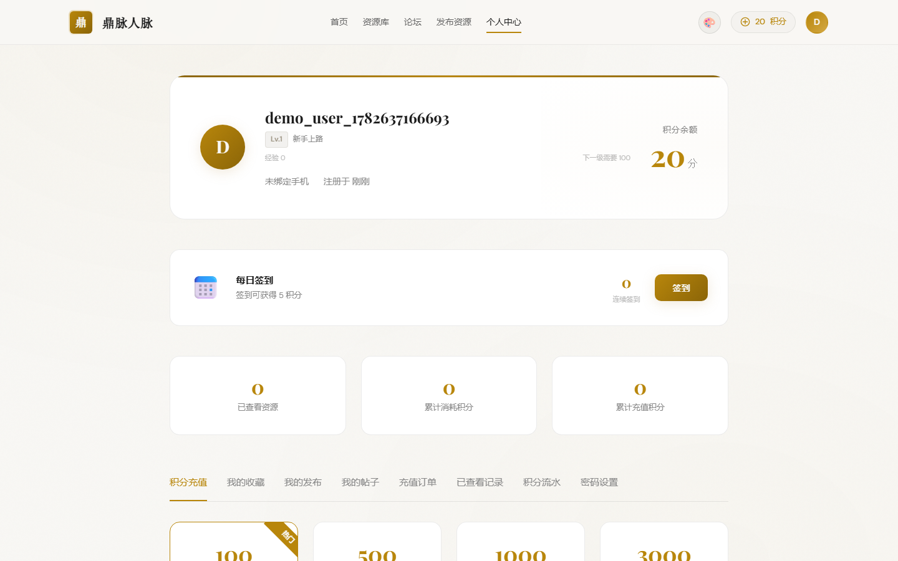
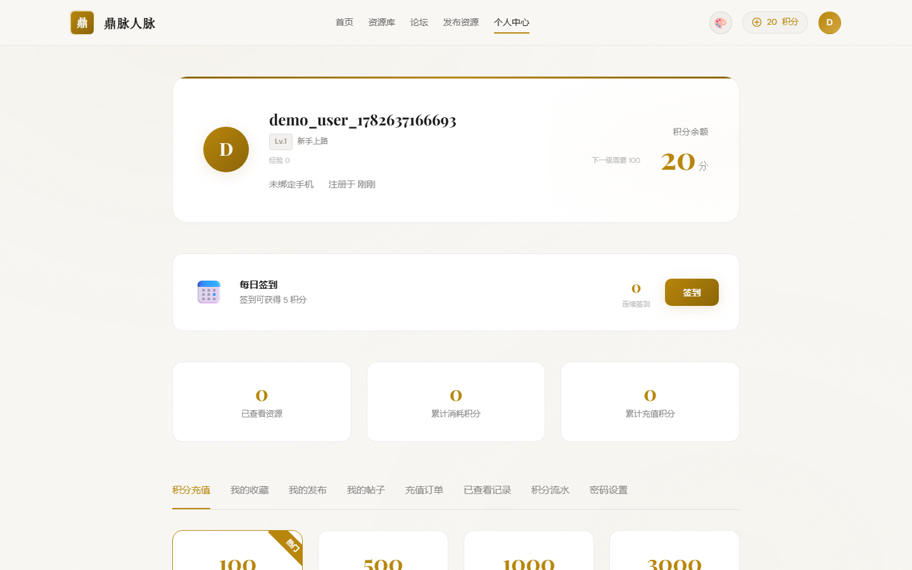
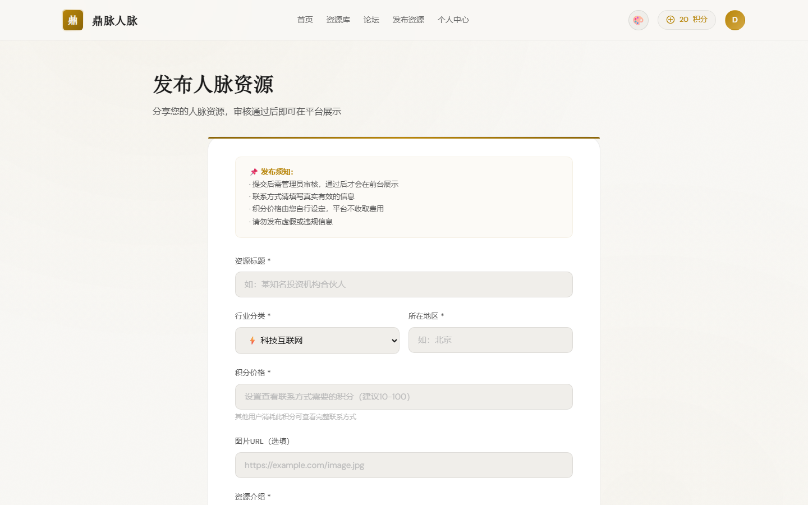
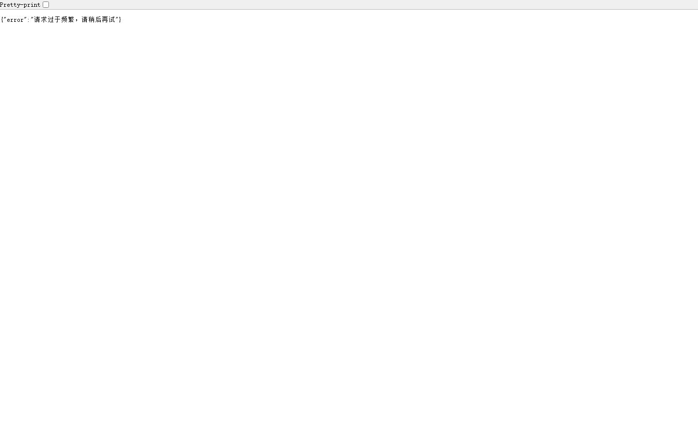

<div align="center">

# 🏛️ 鼎脉人脉 DingMai

**高端人脉资源共享平台**

[](https://nodejs.org)
[](LICENSE)

</div>

---

## ✨ 功能概览

| 功能 | 说明 |
|------|------|
| 🏠 首页展示 | 粒子动画背景，平台定位与数据统计 |
| 📋 人脉资源 | 按领域/城市/等级筛选，会员等级体系 |
| 💬 社区论坛 | 技术交流、资源对接、吐槽灌水、新手求助 |
| 📝 发布资源 | 所见即所得发布，支持图片上传与富文本编辑 |
| 👤 用户中心 | 等级积分、VIP 会员、资源管理、动态消息 |
| 💳 积分充值 | 多档套餐，支付宝 / 微信支付 |
| 🔐 后台管理 | 用户管理、内容审核、系统配置、数据统计 |

---

## 📸 界面预览

### 🏠 首页


### 📋 人脉资源


### 💬 社区论坛


### 🔐 登录注册


### 👤 用户中心


### 💳 积分充值


### 📝 发布资源


### ⚙️ 后台管理


---

## 🚀 快速开始

### 环境要求

- Node.js ≥ 18
- npm 或 yarn

### 安装运行

```bash
# 克隆仓库
git clone https://github.com/liuweihua123/DingMai.git
cd DingMai

# 安装依赖
npm install

# 复制支付配置（如有需要）
cp server/payment-config.example.js server/payment-config.js
cp server/alipay.example.js server/alipay.js
# 编辑上述文件填入真实密钥（已在 .gitignore 中排除）

# 初始化数据（可选）
npm run seed

# 启动服务
npm start
# 访问 http://localhost:3000
```

### 开发模式

```bash
npm run dev   # 自动重启（Node.js --watch）
```

---

## 🏗️ 技术栈

| 层 | 技术 |
|----|------|
| 前端 | 原生 HTML/CSS/JS，渐变暗色主题，粒子动画 |
| 后端 | Express.js |
| 数据库 | SQLite (better-sqlite3) |
| 认证 | JWT (jsonwebtoken + bcryptjs) |
| 支付 | 码支付 / 支付宝 SDK |
| 文件上传 | Multer |

---

## 📁 项目结构

```
├── index.html              # 首页
├── list.html               # 人脉资源列表
├── forum.html              # 社区论坛
├── login.html              # 登录注册
├── publish.html            # 发布资源
├── user.html               # 用户中心
├── admin.html              # 后台管理
├── post.html               # 帖子详情
├── detail.html             # 资源详情
├── payment-result.html     # 支付结果页
├── css/
│   ├── style.css           # 主样式
│   └── themes.css          # 主题配色
├── js/
│   ├── api.js              # API 请求封装
│   └── common.js           # 公共工具函数
├── server/
│   ├── index.js            # Express 入口
│   ├── db.js               # 数据库初始化
│   ├── auth.js             # JWT 认证
│   ├── alipay.js           # 支付宝配置（需自行配置）
│   ├── payment-config.example.js  # 支付配置示例
│   ├── seed.js             # 种子数据
│   └── routes/             # API 路由
└── docs/screenshots/       # 项目截图
```

---

## ⚠️ 安全说明

- 支付密钥文件已通过 `.gitignore` 排除，请勿提交真实密钥
- JWT 密钥建议通过环境变量 `JWT_SECRET` / `JWT_ADMIN_SECRET` 设置
- 上传用户头像限制 10MB，仅允许图片格式

---

## 📄 License

MIT